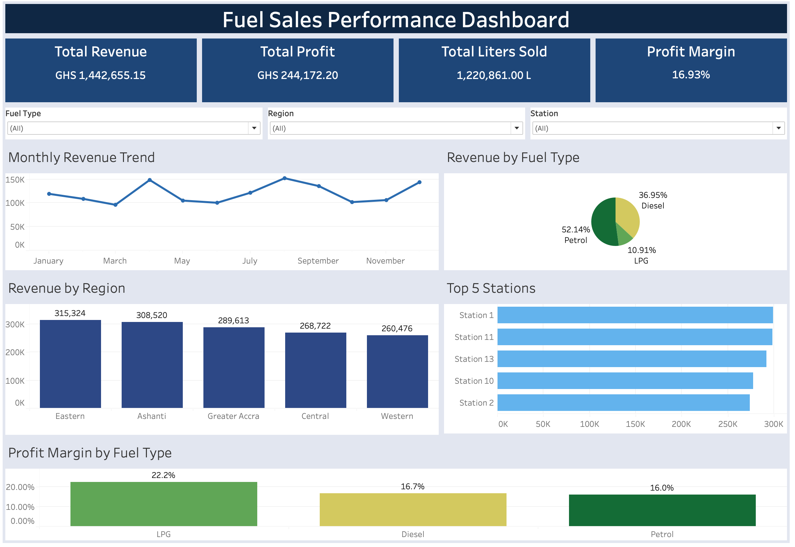
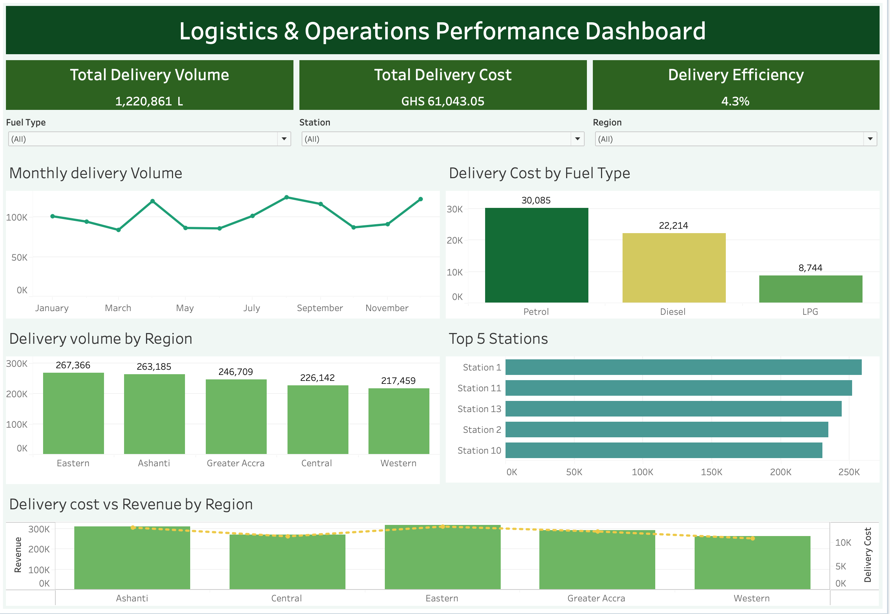
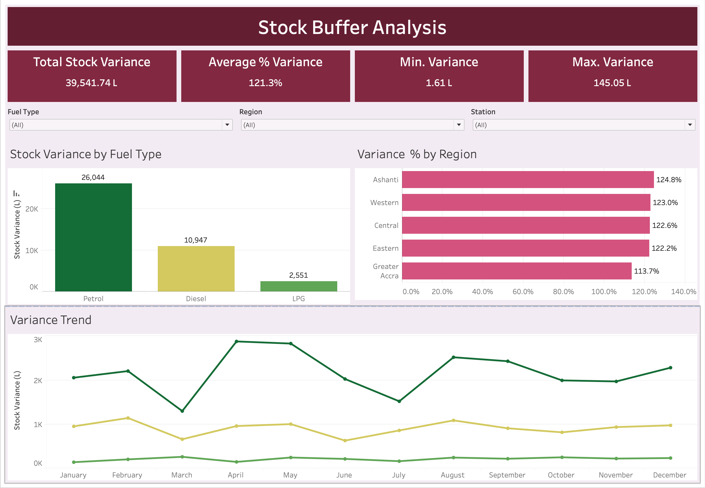

# Fuel Sales, Logistics & Stock Buffer Performance Dashboard

An interactive 3-dashboard portfolio analysing fuel sales performance, logistics operations, and stock buffer variance across regions and fuel retail outlets (stations), built in both Excel and Tableau to demonstrate how the same dataset can be approached differently across tools.

---

## 📊 Live Interactive Dashboards (Tableau)

| Dashboard | Link |
|---|---|
| Fuel Sales Performance | [View on Tableau Public](https://public.tableau.com/app/profile/henrietta.mensah/viz/fuel_sales_logistics_dashboard_rev/FuelSalesdashboard) |
| Logistics & Operations | [View on Tableau Public](https://public.tableau.com/app/profile/henrietta.mensah/viz/fuel_sales_logistics_dashboard_rev/LogisticsOperationsDashboard) |
| Stock Buffer Analysis | [View on Tableau Public](https://public.tableau.com/views/fuel_sales_logistics_dashboard_rev/StockBufferAnalysisDashboard) |

---

## 🎯 Business Problem

Fuel distribution and operations across multiple regions and fuel retail outlets face a recurring challenge, revenue, delivery and stock data exist in separate operational reports, making it difficult to answer critical questions all at once:

- Which fuel types and regions are driving the most revenue?
- Are high-revenue regions also the most efficient to serve logistically?
- Which stations are underperforming relative to their delivery volume?
- Where are delivery costs disproportionately high compared to revenue generated?
- Which fuel types and regions are carrying the largest stock buffers, and is the surplus being managed efficiently?

This project consolidates sales, logistics and stock variance data into three interactive dashboards so stakeholders can answer these questions without switching between spreadsheets.

---

## 📊 Key Performance Indicators

| Metric | Value |
|---|---|
| Total Revenue | GHS 3,875,218.60 |
| Total Profit | GHS 658,353.60 |
| Total Liters Sold | 3,291,768 L |
| Profit Margin | 16.99% |
| Total Delivery Cost | GHS 164,588.40 |
| Delivery Efficiency | 4.3% |
| Total Stock Variance | 39,541.74 L |
| Average Variance % | 121.3% |
| Max Single Variance | 145.05 L |
| Min Single Variance | 1.61 L |

---

## 📊 Dashboard Previews

### Fuel Sales Performance Dashboard

### Logistics & Operations Performance Dashboard

### Stock Buffer Analysis Dashboard

---

## 🔄 Excel vs Tableau — Tool Comparison

This project was deliberately built in both tools to demonstrate analytical judgement about when each tool is appropriate.

| Aspect | Excel version | Tableau version |
|---|---|---|
| Filtering | Slicers connected to pivot charts | Interactive dropdowns applied across all charts simultaneously |
| Combo chart | Not built, difficult to achieve cleanly | Revenue bars + delivery cost line overlay per region |
| Sharing | Requires Excel to open and interact | Live and interactive on Tableau Public, no software needed |
| Colour design | Multi-colour bars per category | Single-colour bars, colour only used where it adds analytical value |
| Calculated fields | Formulas in pivot table | Calculated fields for profit margin, variance status, and stock buffer metrics |
| Best for | Business users who work in Excel daily | Sharing with wider audiences and web publishing |

---

## 🔧 My Process

**1 — Data cleaning & structuring**
Standardized date formats, verified fuel type categories, checked for missing delivery records, and validated revenue, cost and stock variance figures across all 15 stations and 5 regions.

**2 — Excel dashboard**
Built pivot tables for all metrics, designed two dashboard sheets with slicers connected across all charts, and added a KPI summary row at the top of each dashboard.

**3 — Tableau rebuild with design improvements**
Rebuilt all dashboards in Tableau making deliberate design decisions, simplified colour scheme with distinct themes per dashboard (navy blue for sales, dark green for logistics, deep crimson for stock buffer), added a calculated profit margin field, built a combo chart not possible in Excel, and published to Tableau Public for interactive web access.

**4 — Stock Buffer Analysis dashboard**
Extended the project with a third dashboard dedicated to stock variance analysis. Identified that all variance values were positive (surplus stock) and reframed the analysis as a buffer efficiency story examining which fuel types and regions carry the largest surplus and how that trend moves month-on-month.

**5 — Tool comparison**
Documented the differences between both versions to demonstrate analytical maturity knowing which tool to use for which purpose is as important as knowing how to use them.

---

## 🔍 Key Findings & Business Implications

### Sales Dashboard

- **LPG has the highest profit margin at 22.2%**, despite being the lowest revenue fuel type. Petrol drives 51% of revenue but earns only 16.0% margin, meaning volume and profitability tell different stories that both matter for business decisions.

- **Eastern region leads in revenue at GHS 315K.** Station 1 is the top performer, the performance gap between top and bottom stations suggests an opportunity to investigate what drives Station 1's results and replicate them elsewhere.

- **Revenue peaks in February, May and August**, indicating seasonal demand fluctuations. Procurement and staffing plans should account for these cycles rather than treating demand as flat throughout the year.

### Logistics Dashboard

- **Delivery efficiency of 4.3%** means logistics cost consumes less than 5 cents of every GHS 1 of revenue a healthy ratio indicating lean operations. The delivery cost vs revenue combo chart confirms this pattern holds consistently across all 5 regions.

- **Petrol has the highest absolute delivery cost**, driven by its volume dominance. Eastern and Ashanti regions handle the highest delivery volumes worth monitoring as these regions scale to ensure efficiency ratios are maintained.

### Stock Buffer Analysis Dashboard

- **Petrol carries the largest stock buffer at 26,044L**, more than double Diesel (10,947L) and over ten times LPG (2,551L). This may indicate over-ordering relative to actual sales volumes for Petrol and warrants a review of procurement planning.

- **Ashanti region holds the highest average variance % at 124.8%**, suggesting stock buffers in that region are consistently above target. Greater Accra runs the leanest buffer at 113.7%, potentially a model for how other regions can tighten stock management.

- **The monthly trend shows Petrol variance spiking in April–May** before settling mid-year, which aligns with the revenue peaks seen in the Sales dashboard, confirming that procurement is responding to seasonal demand, but potentially overcorrecting on the upside.

---

## 📋 Dashboard Features

| Dashboard | Chart / View | Business Question Answered |
|---|---|---|
| Sales | Monthly revenue trend | When are our peak revenue months? |
| Sales | Revenue by fuel type (pie) | Which fuel drives our business? |
| Sales | Revenue by region | Where are our strongest markets? |
| Sales | Top 5 stations by revenue | Which stations should we learn from? |
| Sales | Profit margin by fuel type | Which fuel is most profitable, not just highest revenue? |
| Logistics | Monthly delivery volume trend | Are deliveries aligned with demand cycles? |
| Logistics | Delivery cost by fuel type | Which fuel type is most expensive to move? |
| Logistics | Delivery volume by region | Where do we move the most fuel? |
| Logistics | Top 5 stations by delivery volume | Which stations drive our logistics load? |
| Logistics | Delivery cost vs revenue by region | Are high-revenue regions also efficient to serve? |
| Stock Buffer | Stock variance by fuel type | Which fuel type carries the largest surplus buffer? |
| Stock Buffer | Variance % by region | Which regions are running above target stock levels? |
| Stock Buffer | Variance trend by fuel type (monthly) | Is the stock buffer growing or shrinking over time? |

---

## 🛠 Tools & Techniques

| Tool / Technique | How It Was Used |
|---|---|
| Microsoft Excel | Primary analysis environment: pivot tables, charts, slicers, KPI cards |
| Tableau Public | Interactive web dashboards: calculated fields, combo charts, dropdown filters, dual-axis chart |
| Pivot Tables | Aggregating revenue, cost, profit, delivery and variance metrics by region, fuel type, station, and month |
| Calculated Fields | Profit margin (profit ÷ revenue), delivery efficiency (delivery cost ÷ revenue), variance status (overstocked/understocked classification) |
| Dual-Axis Chart | Revenue bars + delivery cost line overlay, showing both metrics in one view per region |
| KPI Cards | Summary metrics at the top of each dashboard for executive-level readability |
| Reference Lines | Zero-baseline reference lines on variance charts to anchor the analysis |
| Dashboard Theming | Distinct colour themes per dashboard navy, dark green, deep crimson for instant visual navigation across 3 dashboards |

---

## 📁 Files Included

| File | Description |
|---|---|
| `fuel_sales_logistics_dashboard.xlsx` | Interactive Excel dashboard with slicers, full functionality |
| `fuel_sales_logistics_dashboard.pdf` | Static export for quick preview without Excel |
| `fuel_sales_logistics_dataset.csv` | Raw dataset used for analysis |
| `Sales_Dashboard.png` | Screenshot of fuel sales dashboard |
| `Logistics_&_Operations_Dashboard.png` | Screenshot of logistics dashboard |
| `Stock_Buffer_Analysis.png` | Screenshot of stock buffer analysis dashboard |

---

## 💼 Transferable Skills Demonstrated

- Working across multiple BI tools on the same analytical problem, Excel and Tableau
- Making deliberate design decisions and being able to explain the reasoning behind them
- Translating operational data into business-ready insights across sales, logistics and stock management audiences
- Building interactive dashboards that allow non-technical users to explore data independently
- Reframing a dataset where expected patterns (negative variance) are absent identifying that all-positive variance is itself a meaningful insight about stock buffer management
- Identifying where operational inefficiency creates financial cost, not just describing what the data shows
- Applying consistent visual design across multiple dashboards to create a cohesive, professional portfolio piece

---

*Dataset is simulated to reflect real-world fuel distribution operations.*

